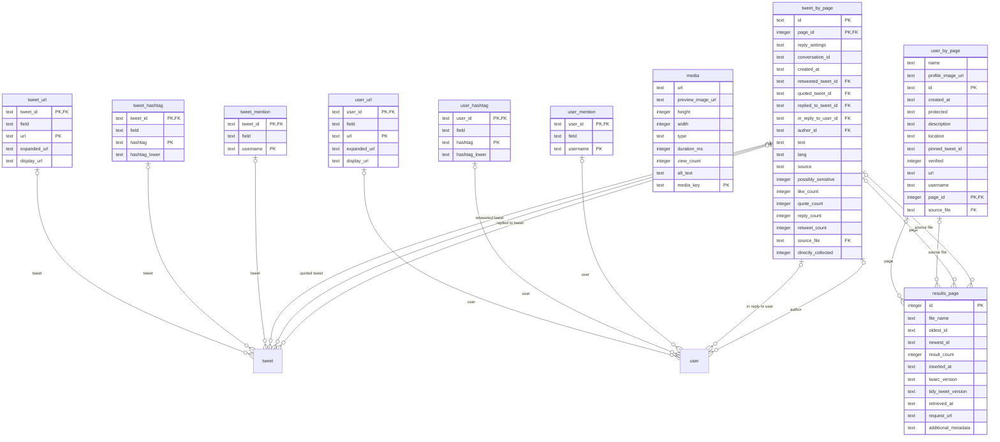

# tidy_tweet database schema

This is an automatically generated document describing the tables and columns in the tidy_tweet database.

Table **tweet_url**:

- **tweet_id** (text primary key references tweet (id))
- **field** (text not null): e.g. "description", "text" - which field of the source object the URL is in
- **url** (text primary key not null): t.co shortened URL
- **expanded_url** (text)
- **display_url** (text)

primary key on conflict ignore

Table **user_url**:

- **user_id** (text primary key references user (id))
- **field** (text not null): e.g. "description", "text" - which field of the source object the URL is in
- **url** (text primary key not null): t.co shortened URL
- **expanded_url** (text)
- **display_url** (text)

primary key on conflict ignore

Table **tweet_hashtag**:

- **tweet_id** (text primary key references tweet (id))
- **field** (text not null): e.g. "description", "text" - which field of the source object the hashtag is in
- **hashtag** (text primary key not null)
- **hashtag_lower** (text): Normalised, as hashtags are case-insensitive on Twitter

primary key on conflict ignore

Table **user_hashtag**:

- **user_id** (text primary key references user (id))
- **field** (text not null): e.g. "description", "text" - which field of the source object the hashtag is in
- **hashtag** (text primary key not null)
- **hashtag_lower** (text): Normalised, as hashtags are case-insensitive on Twitter

primary key on conflict ignore

Table **tweet_mention**:

- **tweet_id** (text primary key references tweet (id))
- **field** (text not null): e.g. "description", "text" - which field of the source object the mention is in
- **username** (text primary key not null): username of mentioned user

primary key on conflict ignore

Table **user_mention**:

- **user_id** (text primary key references user (id))
- **field** (text not null): e.g. "description", "text" - which field of the source object the mention is in
- **username** (text primary key not null): username of mentioned user

primary key on conflict ignore

Table **media**:

- **url** (text)
- **preview_image_url** (text)
- **height** (integer)
- **width** (integer)
- **type** (text)
- **duration_ms** (integer)
- **view_count** (integer)
- **alt_text** (text)
- **media_key** (text primary key)

Table **user_by_page**:

- **name** (text)
- **profile_image_url** (text)
- **id** (text primary key )
- **created_at** (text)
- **protected** (text)
- **description** (text)
- **location** (text)
- **pinned_tweet_id** (text)
- **verified** (integer): boolean
- **url** (text)
- **username** (text)
- **page_id** (integer primary key references results_page (id))
- **source_file** (text references results_page (file_name))

primary key 

Table **tweet_by_page**:

- **id** (text primary key )
- **page_id** (integer primary key references results_page (id))
- **reply_settings** (text)
- **conversation_id** (text)
- **created_at** (text)
- **retweeted_tweet_id** (text references tweet (id))
- **quoted_tweet_id** (text references tweet (id))
- **replied_to_tweet_id** (text references tweet (id))
- **in_reply_to_user_id** (text references user (id))
- **author_id** (text references user (id))
- **text** (text)
- **lang** (text)
- **source** (text)
- **possibly_sensitive** (integer): boolean
- **like_count** (integer)
- **quote_count** (integer)
- **reply_count** (integer)
- **retweet_count** (integer)
- **source_file** (text references results_page (file_name))
- **directly_collected** (integer): boolean

primary key 

Table **results_page**:

- **id** (integer primary key)
- **file_name** (text)
- **oldest_id** (text): oldest tweet id in page
- **newest_id** (text): newest tweet id in page
- **result_count** (integer): count given in API response
- **inserted_at** (text default current_timestamp)
- **twarc_version** (text)
- **tidy_tweet_version** (text)
- **retrieved_at** (text): time response from twitter was recorded
- **request_url** (text)
- **additional_metadata** (text): extra metadata from twarc and twitter

