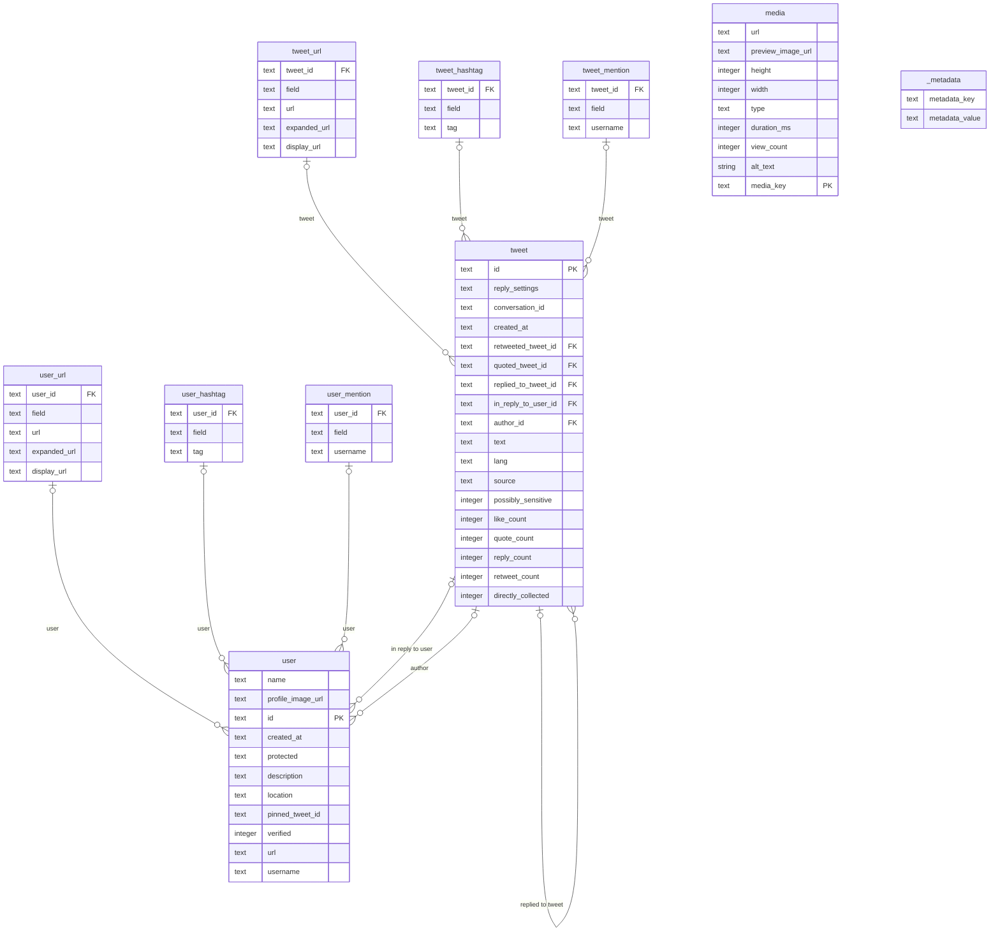

# tidy_tweet database schema

This is an automatically generated document describing the tables and columns in the tidy_tweet database.

Table **tweet_url**:
- **tweet_id** (text references tweet (id))
- **field** (text not null): e.g. "description", "text" - which field of the source object the URL is in
- **url** (text not null): t.co shortened URL
- **expanded_url** (text)
- **display_url** (text)

Table **user_url**:
- **user_id** (text references user (id))
- **field** (text not null): e.g. "description", "text" - which field of the source object the URL is in
- **url** (text not null): t.co shortened URL
- **expanded_url** (text)
- **display_url** (text)

Table **tweet_hashtag**:
- **tweet_id** (text references tweet (id))
- **field** (text not null): e.g. "description", "text" - which field of the source object the hashtag is in
- **tag** (text not null)

Table **user_hashtag**:
- **user_id** (text references user (id))
- **field** (text not null): e.g. "description", "text" - which field of the source object the hashtag is in
- **tag** (text not null)

Table **tweet_mention**:
- **tweet_id** (text references tweet (id))
- **field** (text not null): e.g. "description", "text" - which field of the source object the mention is in
- **username** (text not null): username of mentioned user

Table **user_mention**:
- **user_id** (text references user (id))
- **field** (text not null): e.g. "description", "text" - which field of the source object the mention is in
- **username** (text not null): username of mentioned user

Table **media**:
- **url** (text)
- **preview_image_url** (text)
- **height** (integer)
- **width** (integer)
- **type** (text)
- **duration_ms** (integer)
- **view_count** (integer)
- **alt_text** (string)
- **media_key** (text primary key)

Table **user**:
- **name** (text)
- **profile_image_url** (text)
- **id** (text primary key)
- **created_at** (text)
- **protected** (text)
- **description** (text)
- **location** (text)
- **pinned_tweet_id** (text)
- **verified** (integer): boolean
- **url** (text)
- **username** (text)

Table **tweet**:
- **id** (text primary key)
- **reply_settings** (text)
- **conversation_id** (text)
- **created_at** (text)
- **retweeted_tweet_id** (text references tweet (id))
- **quoted_tweet_id** (text references tweet (id))
- **replied_to_tweet_id** (text references tweet (id))
- **in_reply_to_user_id** (text references user (id))
- **author_id** (text references user (id))
- **text** (text)
- **lang** (text)
- **source** (text)
- **possibly_sensitive** (integer): boolean
- **like_count** (integer)
- **quote_count** (integer)
- **reply_count** (integer)
- **retweet_count** (integer)
- **directly_collected** (integer): boolean

Table **_metadata**:
- **metadata_key** (text): primary key on conflict fail,
- **metadata_value** (text)

